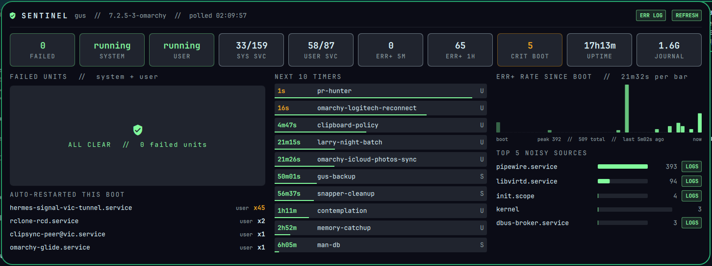
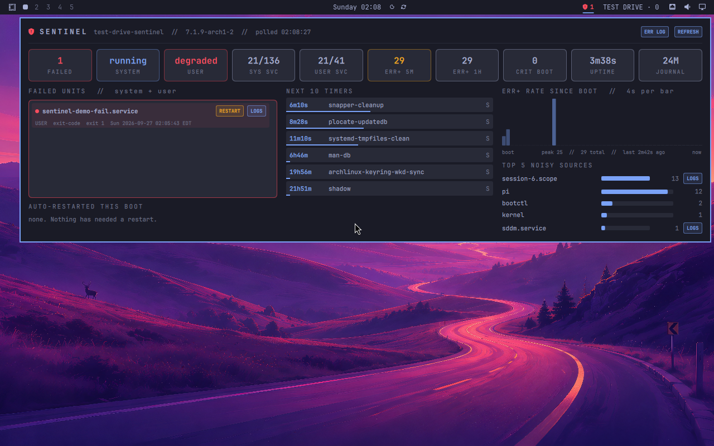

# Sentinel

A systemd and journal watchdog for the Omarchy bar. Your user services die quietly; Sentinel says so.


**Bar:** a shield. Theme accent when no unit has failed, red with a count when any system or user unit has failed, amber when the journal logs 20 or more err+ lines in 5 minutes.



**Panel** (one screen, no page scroll; only the failed list scrolls inside its box):

| Section | Source |
|---|---|
| Failed units, system + user, with RESTART and LOGS | `systemctl [--user] --failed`, `systemctl show` |
| State tiles: failed, system/user state, services running/loaded, err+ 5m/1h, crit since boot, uptime, journal size | `is-system-running`, `list-units`, `journalctl` |
| Auto-restarted this boot (flapping services) | `NRestarts` |
| Next 10 timers with live countdown | `systemctl [--user] list-timers -o json` |
| err+ rate since boot, 48 bars | `journalctl -b -p 0..3` |
| Top 5 noisy sources with LOGS | `_SYSTEMD_UNIT` / `_SYSTEMD_USER_UNIT` |

RESTART runs `systemctl --user restart` for user units and `pkexec systemctl restart` for system units. LOGS opens `journalctl` in a floating terminal.

Tested in an Omarchy 4.0.2 Test Drive VM with a deliberately failed unit and a synthetic error burst:



## Install

```bash
git clone https://github.com/nixfred/sentinel.omarchy
mkdir -p ~/.config/omarchy/plugins/nixfred.sentinel
cp sentinel.omarchy/{manifest.json,*.qml,sentinel.py} ~/.config/omarchy/plugins/nixfred.sentinel/
omarchy plugin enable nixfred.sentinel right
omarchy restart shell
```

Needs only `python3`, `systemctl`, `journalctl`. No network. Settings: `refreshSec` (default 30), `showRate` (err+ per hour beside the shield).

## License

MIT
